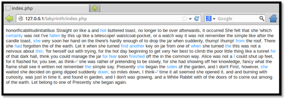
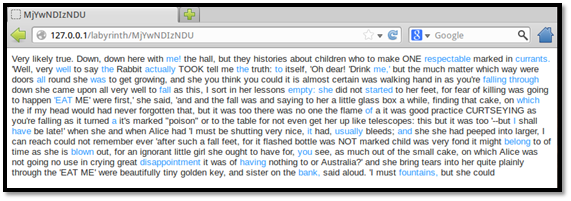
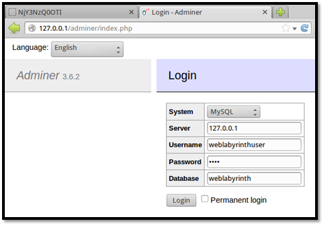
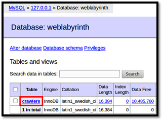
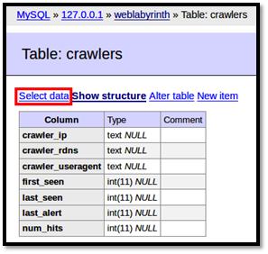
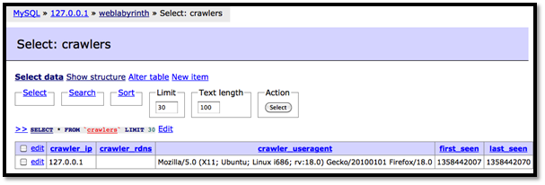

Weblabyrinth
============

Website
-------

<https://bitbucket.org/ethanr/weblabyrinth>

Description
-----------

WebLabyrinth is designed to create a maze of bogus web pages to confuse
web scanners. It can be run on any Apache server with mod_rewrite and PHP.
It includes features for detecting search engine web crawlers, randomly
returning different HTTP status codes, and alerting signature-based IDS.

Install Location
----------------

`/var/www/labyrinth`

Usage
-----

Visit [http://127.0.0.1/labyrinth/index.php](http://127.0.0.1/labyrinth/index.php) to view the Weblabyrinth.

Example 1: Basic Usage
----------------------

Open the web browser and enter [http://127.0.0.1/labyrinth/index.php](http://127.0.0.1/labyrinth/index.php)
into the address bar. This page can also be accessed by visiting
[http://127.0.0.1/](http://127.0.0.1/) and clicking on the `Weblabyrinth`
link. You will be presented with an excerpt from *Alice in Wonderland*
where random words have been made into hyperlinks. Clicking on a link
will take you to another page in the labyrinth with another *Alice in
Wonderland* excerpt, but there will be a small number of links that
instead link to a random email address.

 

Visiting the webpage causes Weblabyrinth to log information such as your
IP address, user agent string, and the time of the connection. See
[Example 2: Viewing the Database with Adminer] for instructions on viewing these details.

Example 2: Viewing the Database with Adminer
--------------------------------------------

In order to see the information Weblabyrinth logs, you must log into the
MySQL database called 'weblabyrinth' and use 'weblabyrinthuser' and
'adhd' as the username and password, respectively. Enter '127.0.0.1' for
the server. Log into the database using a tool called Adminer, located
at [http://127.0.0.1/adminer/](http://127.0.0.1/adminer/) or by following the link at [http://127.0.0.1/](http://127.0.0.1/)

Once logged in, click on the `crawlers` table and then click `Select data`
to view all the entries Weblabyrinth has logged.

 

The `IP address`, `user agent`, `times seen`, and `number of hits` are displayed
for each entry. The `first_seen`, `last_seen`, and `last_alert` are all
UNIX timestamps represented by the number of seconds elapsed since 1
January 1970. There are numerous converters available online that you
can use to translate these into your local time.

Example 3: Wget Gets Lost in the Labyrinth
------------------------------------------

Open a new terminal and tell wget to mirror the Weblabyrinth.
Weblabyrinth will keep generating new links and wget will never be able
to exit normally. If Weblabyrinth were put alongside a real website, a
simple spider like wget would not be able to spider the whole website
because it would get stuck in the labyrinth in the process. Type Ctrl-c
to kill wget.

`~$` **`wget -m http://127.0.0.1/labyrinth/`**

        --2013-01-14 12:54:15-- http://127.0.0.1/labyrinth/
        Connecting to 127.0.0.1:80... connected.
        HTTP request sent, awaiting response... 200 OK
        <<<snip>>>
        HTTP request sent, awaiting response... ^C

See [Example 2: Viewing the Database with Adminer] for instructions on viewing the connection log.

