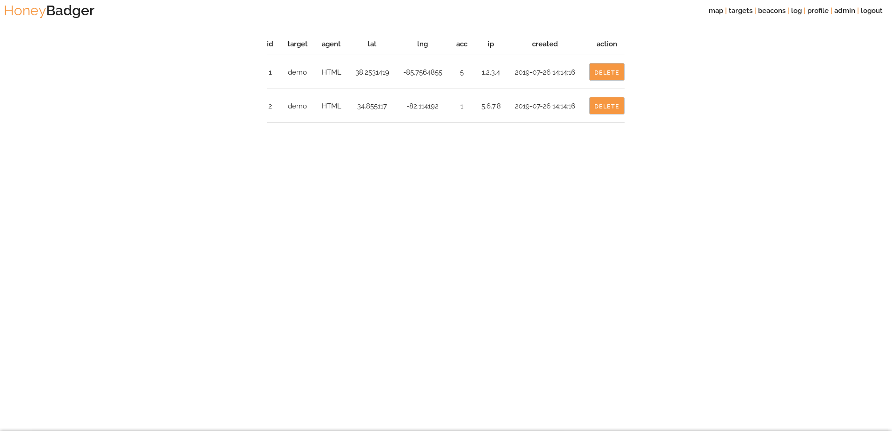
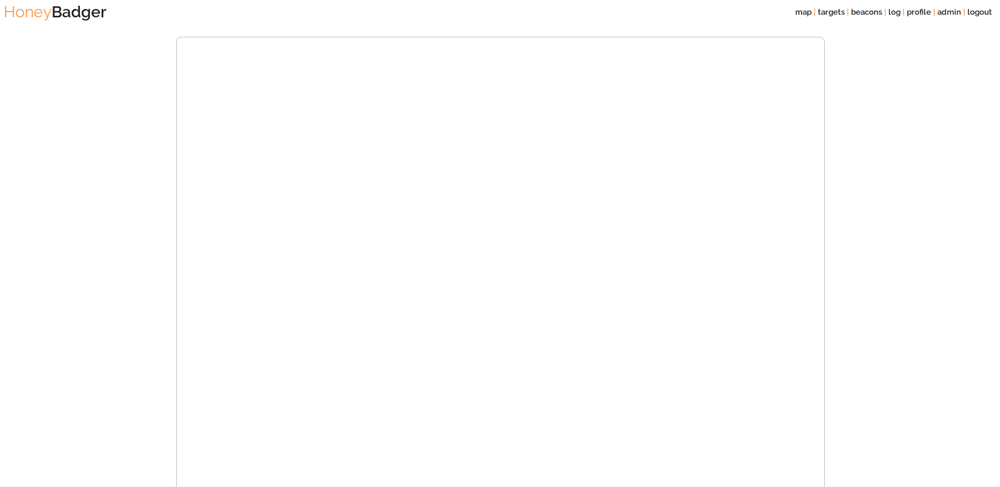
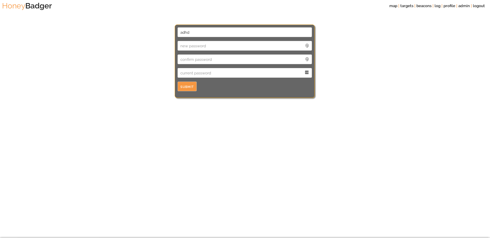
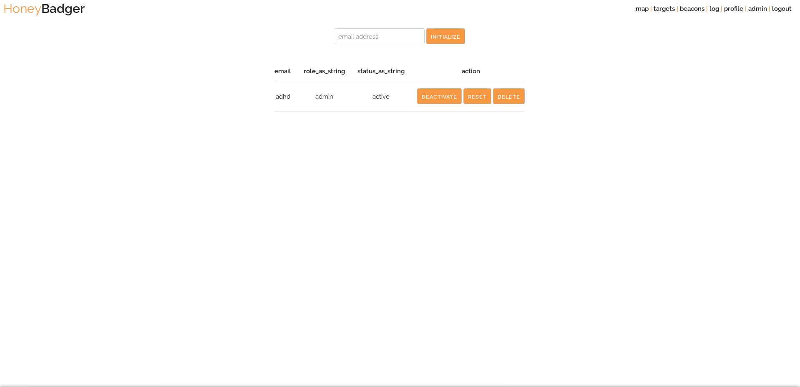
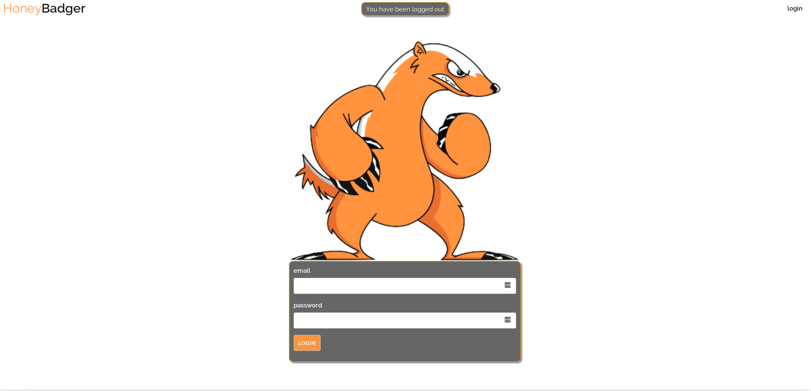
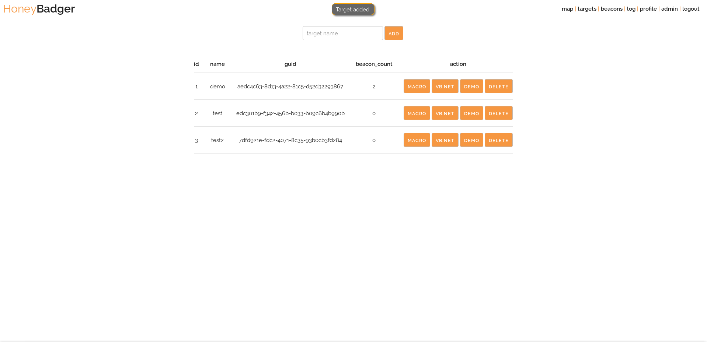
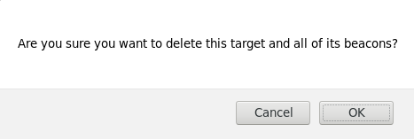

HoneyBadger
=========================

Website
-------

<https://github.com/...>

Description
-----------

Used to identify the physical location of a web user with a combination
of geolocation techniques using a browser's share location feature, the
visible WiFi networks, and the IP address.

Updates
-------

What's new in HoneyBadger?

* Updated to Python 3.x
* API keys extracted as CLI arguments
* New fallback geolocation APIs added (IPStack, IPInfo.io)
* New utilities for automatic wireless surveying (Windows, Linux)
* New beacon agents (VB.NET, VBA)

Install Location
----------------

`/opt/honeybadger/`

Usage
-----

Install requirements:
    pip install -r requirements.txt

Initialize Database:
    python3
    import honeybadger
    honeybadger.initdb('adhd', 'adhd')

Start the HoneyBadger server

Example 1: Overview
-------------------
The HoneyBadger UI has many features. This section will give a brief overview of HoneyBadger's pages.

Navigate to the HoneyBadger server, and you will be presented with the following screen:

Use the credentials set earlier to log in, and you will be brought to the map.

To navigate to other pages of HoneyBadger, use the navigation bar in the top right corner:

### 1. Map ###
The map is the default landing page after logging in.

The map is the main event of HoneyBadger in terms of presentation, and will pin a location when a beacon is triggered.

### 2. Targets ###
Navigate to the targets page.

The targets page is where targets can be observed, added, or removed, The page also serves as a way to generate several agents that are not quickly generated manually.

### 3. Beacons ###
Navigate to the beacons page.

The beacons page maintains a list of beacons that connect to HoneyBadger and successfully geolocate. Beacons can be removed from this page as well.

### 4. Log ###
Navigate to the log page.

The log page is populated with information as beacons attempt to connect to the HoneyBadger server, and may be empty if accessed before any beacons connect to the server.

### 5. Profile ###
Navigate to the profile page.

The profile page allows for changing the password of the currently logged in account.

### 6. Admin ###
Navigate to the admin page.

The admin page is where administrative actions can be performed on accounts, and where new accounts can be added.

### 7. Logout ###
Clicking logout on the navbar will log you out, bringing you back to the login page.

Example 2: Using the Map
-----------------------------
Navigate to the map page.

At its core, the map page uses the Google Maps API, and functions identically to the standard Google Maps.

Several options are available for filtering map points by targets and by agents, using the map legend:

As targets are added or unique agents are used to beacon into a target, they will show up in this legend. Toggling checkboxes in the legend enables filtering of beacons that are displayed in the map.

Points on the map can be clicked to display information about the machine that beaconed in:

Example 3: Working with Targets
-------------------------------
Navigate to the targets page.

Take a closer look at the information associated with the demo target:

Moving left to right:
- id: list id number
- name: name of the target
- guid: unique id of the target
- beacon_count: number of beacons associated with the target
- action: available actions regarding the target (discussed in Example #)

Note that clicking on any of the first four table headings will sort the table based on that column in ascending or descending order, as indicated by an arrow that appears upon clicking.

To add a new target, enter the target name in the field at the top of the page, and click the add button.

The new target will appear in the list:

Two agents can be generated from this page, one for VBA Office macros and one for VB.NET.

To delete a target, click the target's delete button. A prompt will appear:

Click OK, and the target will be removed from the list.

Example 4: Working with Beacons
-------------------------------

Example 5: Observing the Log
----------------------------

Example 6: Changing Profile Information
---------------------------------------

Example 7: Administration
-------------------------

Example 2: Agents
-----------------
### 1. Demo ###
### 2. VBA ###
### 3. VB.NET ###
### 4. HTML ###
